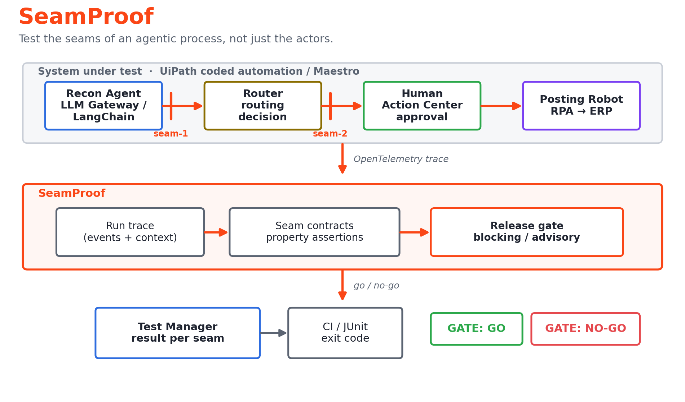
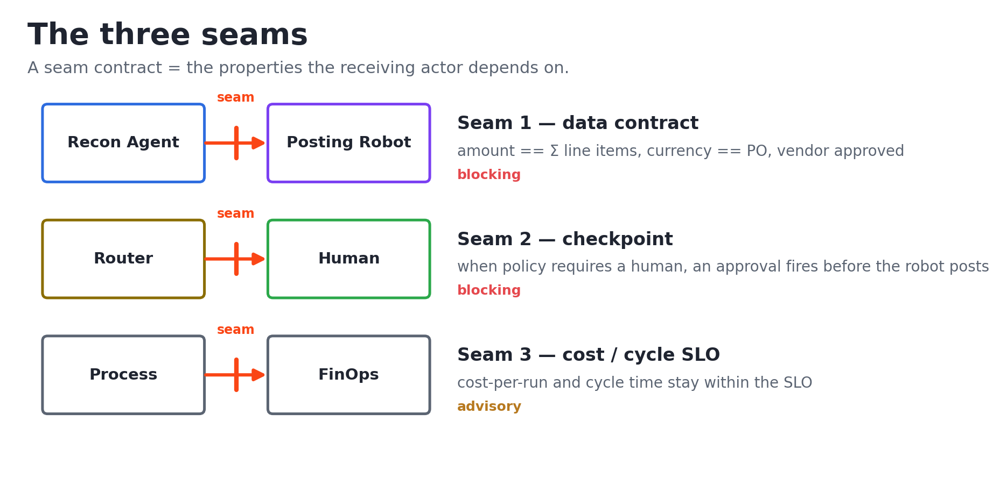

<div align="center">

# SeamProof

### The seam tester for agentic processes.

**SeamProof tests the _handoffs_ between an AI agent, an RPA robot, and a human approver — catching the failures that emerge at the seams between actors, and blocking the release before they reach production.**

[](https://github.com/ankitlade12/seamproof/actions/workflows/ci.yml)
[](LICENSE)
[](pyproject.toml)
[](https://www.uipath.com/product/test-cloud)

<br/>



</div>

---

## The problem

In an agentic business process, an AI agent, an RPA robot, and a human approver
run together in one flow. But testing today validates each actor **in
isolation** — the agent's eval here, the robot's test there, the human step
assumed correct. The failures that actually cause production incidents emerge **at
the seams between actors**:

- **Agent → Robot (silent corruption).** The agent emits *structurally valid but
  semantically wrong* output (right JSON, wrong number) and the robot faithfully
  executes it. The schema check passes; the business outcome is wrong.
- **Routing → Human (skipped checkpoint).** Output variability or a boundary case
  routes work *around* a human approval that policy required — the dangerous case
  auto-completes.
- **Non-functional (cost / SLA drift).** A prompt or model change quietly doubles
  cost-per-run or pushes the end-to-end process past its cycle-time SLO.

Isolated agent evals and unit tests never see these. They live in the connective
tissue.

Concretely, in the bundled case the agent reconciles an invoice to **$5,400** when the
line items sum to **$4,200** — a **$1,200 overpayment** in structurally valid JSON. It
clears schema validation and the robot posts it to the ERP in under two seconds with no
human in the loop. One wrong handoff, one silent loss. SeamProof blocks it at the
release gate, before it ships.

## What SeamProof does

The blocker to putting agents in production isn't the model — it's **governing what
happens when an agent, a robot, and a human hand off to each other**. SeamProof
treats every handoff as a **contract** and tests it against the real run trace. It
asserts trace-level properties at each agent → robot → human boundary and emits a
**go/no-go release gate** with the evidence: the QA layer for *composite* agentic
processes that agent evals and unit tests skip — not the agent, not the app, but the
seams between them.

The seam-contract model is **general** — it applies to any agent → robot → human
process; the bundled invoice-exception process is one reference implementation. Point
it at your own process in three steps: [docs/adopt-seamproof.md](docs/adopt-seamproof.md).
Because it works from the exported run trace, the gate runs **offline** and in CI —
no live cloud call needed to prove a seam broke.

```text
SeamProof — invoice-exception-handling
trace run-seam1-injected · 3 seam contracts

FAIL  Agent to Robot data contract
      seam seam-1 · recon-agent -> posting-robot
      ✗ amount-equals-line-items
        expected 5400 == 4200 (±0.005); differs by 1200
      ✓ currency-matches-po
      ✓ vendor-in-master
      ✓ amount-positive

PASS  Routing to Human checkpoint
      seam seam-2 · router -> approver
      ✓ human-approval-when-required

PASS  Cost and cycle-time SLO [advisory]
      seam seam-3 · process -> finops
      ✓ cost-within-slo
      ✓ cycle-within-slo

GATE: NO-GO  —  release blocked by seam-1
       6/7 assertions passed
```

### The Seam Analyst — the agent that recommends the fix

A gate that only says *no* leaves you to do the diagnosis. Add `--recommend` and the
**Seam Analyst** reads each failed seam and returns a **root cause**, a **concrete
fix**, and a **fragility** rating. It runs as an agent on the UiPath **LLM Gateway**
(the same AI Trust Layer the system under test uses) when credentials are present, and
falls back to a deterministic heuristic offline:

```text
Seam Analyst — recommendations  (llm-gateway)
  seam-1 · recon-agent -> posting-robot  [fragility: high]
      root cause: The value handed from recon-agent to posting-robot disagrees with its
      source of truth (5400 vs 4200) — the upstream actor likely computed it wrong.
      fix: Recompute the total from the source before the robot posts it, or add a
      reconciliation post-condition that blocks the handoff on mismatch.
```

So SeamProof doesn't just *find* the broken seam — it tells you how to close it. The
deterministic gate stays the source of truth for go/no-go; the agent adds the remedy,
and (with `publish --recommend`) that fix is written onto the seam's **Test Manager**
result.

## Quickstart

```bash
# Prerequisites: Python 3.10+
pip install -e .

# Gate a clean run — exits 0 (GO)
seamproof check -c contracts -t examples/traces/golden_happy_path.json

# Gate an injected agent→robot corruption — exits 1 (NO-GO)
seamproof check -c contracts -t examples/traces/seam1_amount_mismatch.json

# …and have the Seam Analyst agent recommend the root cause + fix
seamproof check -c contracts -t examples/traces/seam1_amount_mismatch.json --recommend
```

`seamproof check` exits **non-zero when a blocking seam fails** — that exit code
is what wires the gate into CI or a UiPath Test pipeline. Try every bundled
scenario at once with `make demo`.

## The three seams

The bundled system under test is an **invoice-exception** process (procure-to-pay):
a recon agent reconciles an invoice against its PO, a router decides auto-post vs.
human review, a human approves exceptions, and a robot posts to the ERP.

<p align="center"></p>

| Seam | Boundary | Severity | Catches |
| --- | --- | --- | --- |
| **seam-1** | recon-agent → posting-robot | blocking | A valid-but-wrong total (`amount != sum(line_items)`), wrong currency, or an unknown vendor — before the robot posts it. |
| **seam-2** | router → approver | blocking | A high-value / low-confidence / flagged invoice that auto-posts **around** the human approval policy required. |
| **seam-3** | process → finops | advisory | A model or prompt change that doubles cost-per-run or breaches the cycle-time SLO. Reported without blocking. |

Full reference: [docs/seam-contracts.md](docs/seam-contracts.md).

## How it works

A **seam contract** is the set of properties the *receiving* actor depends on,
written as plain YAML so it reads like policy and diffs cleanly in review:

```yaml
# contracts/seam1-agent-to-robot.yaml  (excerpt)
id: seam-1
name: Agent to Robot data contract
severity: blocking
boundary: { from: recon-agent, to: posting-robot }
handoff:
  source: { type: robot.input }       # the payload crossing the boundary
assertions:
  - id: amount-equals-line-items
    kind: equals
    description: Posted amount must equal the sum of the invoice line items.
    left:  { ref: handoff.amount }
    right: { ref: "handoff.line_items[*].amount", reduce: sum }
    tolerance: 0.005
```

SeamProof builds an evaluation document per seam (`handoff`, `context`, `events`,
`metrics`), evaluates each assertion against it, and aggregates the results into a
gate. The contract language is **data-only — no `eval`, no code execution** — so a
contract is reviewable as config and an untrusted trace can never run code
([architecture](docs/architecture.md) · [security](SECURITY.md)).

### Output formats

One gate result, four renderers — pick the one your pipeline consumes:

```bash
seamproof check -c contracts -t <trace> -f text       # coloured console (default)
seamproof check -c contracts -t <trace> -f markdown   # PR comment / write-up
seamproof check -c contracts -t <trace> -f json        # machine-readable
seamproof check -c contracts -t <trace> -f junit -o report.xml   # Test Manager / CI
```

## Run it against UiPath

SeamProof reads UiPath Maestro's **OpenTelemetry** trace export and writes the
verdict back to **UiPath Test Manager** — the two ends of a real platform
integration:

```bash
# Gate a Maestro OTLP export directly (ingestion happens inline)
seamproof check -c contracts --otel examples/otel/maestro_seam1_export.json

# …or normalise the export to a SeamProof trace first
seamproof ingest --otel examples/otel/maestro_seam1_export.json -o trace.json

# Publish the gate result to Test Manager (--dry-run prints the exact request plan)
uipath auth   # or set UIPATH_URL + UIPATH_ACCESS_TOKEN
seamproof publish -c contracts --otel examples/otel/maestro_seam1_export.json \
  --project <PROJECT_ID> --container <SECTION_ID> --dry-run
```

Authentication uses UiPath's standard credentials. With the official SDK
installed (`pip install "seamproof[uipath]"`), publishing goes through
`uipath.platform.UiPath`, which handles auth and org/tenant scoping; without it,
SeamProof falls back to a stdlib REST call using `UIPATH_URL` +
`UIPATH_ACCESS_TOKEN`. The publisher targets the real Test Manager **v2** API
(execution → per-seam logs → results → finish); everything is testable offline via
`--dry-run` and the bundled OTLP fixture. Full runbook:
[docs/publish-to-test-manager.md](docs/publish-to-test-manager.md).

> **Proof it ran on the tenant — not a dry run.** `seamproof publish` posted a real
> execution to a live **Test Manager** project, which finished with the per-seam results
> — **seam-1 Failed, seam-2/3 Passed, status Finished (2 passed · 1 failed)**. The
> result, fetched straight back from the Test Manager v2 API, is committed at
> **[docs/evidence/test-manager-evidence.md](docs/evidence/test-manager-evidence.md)**
> (raw API JSON alongside it), and CI is green on every push.

> Which parts need a tenant? `check` and `ingest` over the bundled fixture run **fully
> offline** (that's `make demo`). `seamproof publish` and `uipath run` are the
> **tenant-live** steps — the proof above is the captured result of running them.

Need a real trace to feed it? The system under test ships as a runnable **UiPath
coded automation** in [`sut/automation/`](sut/automation/) — `uipath run process
'{"case": "seam1_corruption"}'` executes it on the UiPath runtime (steps traced
with `@traced`, recon via the UiPath LLM Gateway) and emits the OTLP SeamProof gates.

## UiPath components used

SeamProof is a Track 3 (UiPath Test Cloud) solution. The system under test runs on
**UiPath Automation Cloud**, with UiPath as the orchestration and governance
layer:

| Component | Role in the solution |
| --- | --- |
| **UiPath Maestro** | Orchestrates the agent → router → human → robot process and emits the run trace (over OpenTelemetry) that SeamProof ingests. |
| **UiPath Agent Builder** | The recon agent that reconciles the invoice (swappable for an external LangChain agent). |
| **UiPath LLM Gateway (AI Trust Layer)** | Runs the **Seam Analyst** — the agent that reads a failed seam and returns a root-cause + recommended fix + fragility rating (`check --recommend`) — and powers the recon agent in the SUT. |
| **UiPath Action Center** | The human approval task at the routing → human seam. |
| **UiPath Studio / RPA** | The robot that posts approved invoices to the ERP. |
| **UiPath OpenTelemetry export** | Maestro's OTLP agent traces are SeamProof's input — ingested via `seamproof ingest` / `check --otel`. |
| **UiPath Test Cloud / Test Manager** | Receives the gate result via `seamproof publish` (REST API) and as a JUnit report; the gate surfaces as test results that block the release. |
| **UiPath Python SDK (`uipath`)** | Authenticates and posts the gate result to Test Manager, handling org/tenant scoping. |
| **UiPath for Coding Agents** | The channel through which the coding agent authors SeamProof's contracts, scenarios, and reporter. |

> The UiPath project exports live under [`sut/`](sut/). SeamProof itself is
> platform-neutral: it gates any run trace in the documented shape, so the engine
> and its tests run without a UiPath connection.

## Coding agents vs. low-code agents

This project deliberately uses both, and the split is the point:

- **Low-code agents build the system under test.** The recon agent (Agent
  Builder), the robot (Studio), and the human step (Action Center) are authored
  in UiPath's low-code tooling and orchestrated by Maestro.
- **A coding agent builds the tester.** SeamProof's seam contracts, adversarial
  scenarios, and report generator were authored with a **coding agent (Claude
  Code) through UiPath for Coding Agents**, working from the process definition.
  The agent-facing brief lives in [`.agent/EVALS.md`](.agent/EVALS.md).

In short: low-code agents *do the work*; the coding agent *writes the tests that
guard the seams between them*.

## Prerequisites

- **Python 3.10+** (the engine, its tests, and the CLI).
- **To run the full system under test:** a UiPath Automation Cloud account
  (Community tier is sufficient) with Maestro, Agent Builder, Action Center, and
  Test Cloud / Test Manager enabled.
- The engine has a single runtime dependency, **PyYAML**; everything else is the
  Python standard library. OTEL ingestion and REST publishing need nothing extra.
- **Optional:** the official **`uipath`** SDK (`pip install "seamproof[uipath]"`)
  for SDK-based Test Manager publishing. Without it, publishing uses the built-in
  REST transport.

## Setup

```bash
git clone https://github.com/ankitlade12/seamproof.git
cd seamproof

python -m venv .venv && source .venv/bin/activate   # optional but recommended
pip install -e ".[dev]"                              # engine + test/lint tooling

make check     # ruff + pytest
make demo      # run the gate against every example trace
```

To connect a real run: publish the process under [`sut/`](sut/) to UiPath
Automation Cloud, map its Maestro audit events onto the trace schema in
[docs/architecture.md](docs/architecture.md), and point `seamproof check` at the
exported trace.

## Repository layout

```
seamproof/
├── src/seamproof/        # engine + adapters: trace, expr, contracts, evaluators, gate, report, ingest, publish, cli
├── contracts/            # seam contracts for the invoice-exception process (YAML)
├── examples/traces/      # sample run traces: golden + one injected failure per seam
├── examples/otel/        # sample UiPath Maestro OpenTelemetry export (OTLP/JSON)
├── scenarios/            # scenario suite mapping each trace to its expected gate outcome
├── sut/                  # system under test — UiPath Maestro / Agent Builder / RPA exports
│   └── automation/       # runnable UiPath coded automation (uipath.json, @traced steps) of the same process
├── tests/                # unit tests + data-driven scenario regression suite
├── docs/                 # architecture, seam-contract reference, runbooks, evidence
└── .agent/EVALS.md       # brief for the coding agent that authors the seams
```

## Testing

```bash
make test     # pytest: unit tests + the scenario suite
make lint     # ruff
```

The scenario suite ([tests/test_scenarios.py](tests/test_scenarios.py)) drives the
real engine over every trace and asserts its gate outcome, and a guard fails CI if
a sample trace is ever left uncovered. CI additionally proves the gate *fails
closed*: it asserts an injected seam violation returns a non-zero exit.

## Roadmap

- Auto-discover seams from a Maestro process export.
- A web report UI for the gate.
- More assertion kinds (statistical drift, schema evolution).
- Baseline-vs-candidate diffing for true A/B regression.
- Broader systems under test (transaction-dispute intake, claims).

## Hackathon

Built for **UiPath AgentHack 2026 — Track 3 (UiPath Test Cloud)**. SeamProof
reimagines testing for AI-driven enterprise processes: instead of evaluating each
agent in isolation, it tests the seams where agents, robots, and humans hand off —
the boundaries where production actually breaks.

It maps to all four of Track 3's asks for testing agents:

- **Validate AI-infused workflows** — the gate asserts the agent → robot → human seams
  against the real run trace and emits go/no-go.
- **Recommend fixes** — the **Seam Analyst** (LLM Gateway agent) returns a root cause
  and a concrete remediation for every failed seam.
- **Surface the fragile seams** — the Seam Analyst rates how likely each failing handoff
  is to recur, so you know which seams to harden first.
- **Evaluate requirements** — seam contracts *are* the executable requirements for a
  handoff; the analyst reasons about which one broke and why.

## License

[Apache License 2.0](LICENSE) © 2026 Ankit Lade.
