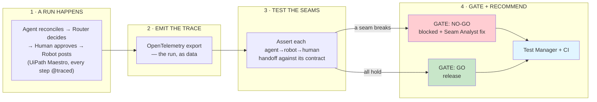
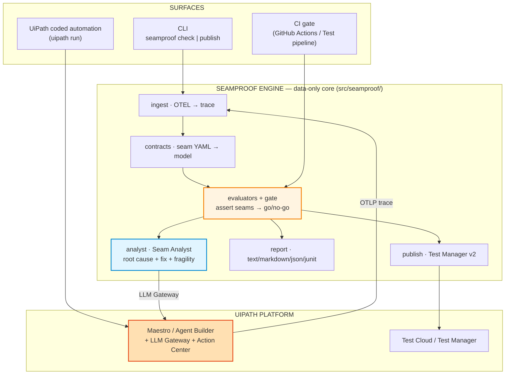
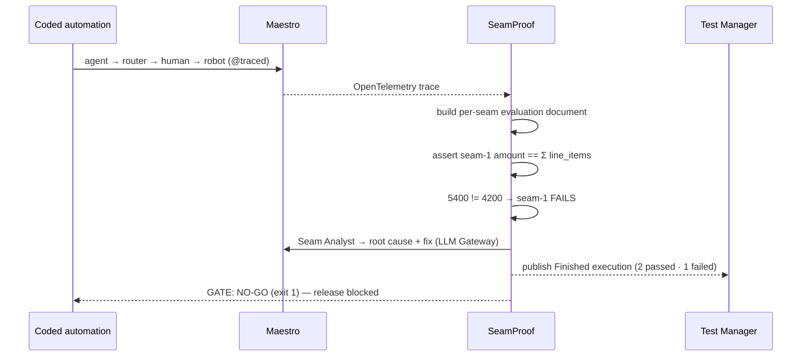

<div align="center">

# SeamProof — The Release Gate for Agent → Robot → Human Handoffs

**Built with:** Python 3.10+ · UiPath Maestro (OpenTelemetry) · UiPath LLM Gateway (AI Trust Layer) · UiPath Action Center · UiPath Test Cloud / Test Manager v2 · UiPath Coded Agents (`uipath` SDK) · `uipath eval` · LangChain (`uipath-langchain`) · UiPath for Coding Agents · data-only core · ruff · pytest · Apache-2.0

[](https://github.com/ankitlade12/seamproof/actions/workflows/ci.yml)
[](LICENSE)
[](pyproject.toml)
[](https://www.uipath.com/product/test-cloud)
[](tests/)
[](https://github.com/astral-sh/ruff)


</div>

> **Agent evals test the actor. SeamProof tests the _handoff_.**
> It doesn't find better models. It tells you which handoff between your agent, robot, and human just broke — and blocks the release before it ships.

SeamProof is a **release gate for agentic processes** on UiPath. It treats every handoff — agent → robot → human — as a **contract** and tests it against the real run trace: for each boundary it asserts the properties the *receiving* actor depends on, then emits a **go / no-go** verdict with the evidence. "The agent looks fine, the robot looks fine, the human step looks fine" collapses to the one **seam** that actually failed — and the **Seam Analyst** agent tells you how to close it.

Agent evals already test the agent. SeamProof goes one layer out — to the **seams between actors**, where production actually breaks.

*UiPath AgentHack 2026 — Track 3 (UiPath Test Cloud).*

## Quick Highlights

- **A gate, not a guess** — the verdict is a **deterministic, data-only** evaluation of seam contracts over the run trace (`src/seamproof/evaluators.py`, `gate.py`, fully unit-tested). No `eval`, no code execution, no LLM in the go/no-go path — the trace decides.
- **It answers the question evals can't** — not "is the agent good?" but "did the **agent → robot → human handoff** hold, and if not, which one broke?" That's the move from **actor-level** (an agent eval, a robot unit test) to **seam-level**.
- **The Seam Analyst — an agent that recommends the fix** — on every failed seam, an agent on the **UiPath LLM Gateway** returns a **root cause**, a **concrete fix**, and a **fragility** rating (`check --recommend`), degrading to a deterministic heuristic offline. The tester is itself agentic.
- **Three seams, three real failure modes** — silent corruption (agent→robot), a skipped human checkpoint (routing→human), and cost/SLA drift (advisory). The bundled case posts a **$1,200 overpayment** in valid JSON; SeamProof blocks it.
- **Verified end-to-end on a live tenant** — `seamproof publish` posted a real **Finished** Test Manager execution (seam-1 Failed · 2 passed · 1 failed), captured back from the v2 API and committed as [evidence](docs/evidence/test-manager-evidence.md). Not a fixture.
- **Ships two ways** — a **CLI** (`seamproof check` / `publish`, four report formats, CI exit code) *and* a runnable **UiPath coded automation** (`uipath run`, `@traced`, LLM Gateway, Action Center) that emits the trace.
- **Data-only core, 74 tests, ruff clean** — the engine's one runtime dependency is PyYAML; the `uipath` SDK is an optional extra. `make lint && make test` is hermetic — no network, no live tenant.

## Artifacts

| Artifact | Where | Notes |
|---|---|---|
| **Live Test Manager execution** | SeamProof project — `140a2ed2…` | real **Finished** execution: seam-1 Failed, **2 passed · 1 failed** |
| **Evidence (from the API)** | [`docs/evidence/test-manager-evidence.md`](docs/evidence/test-manager-evidence.md) | the execution + per-seam results, fetched back from Test Manager v2 (raw JSON alongside) |
| **UiPath coded automation** | [`sut/automation/`](sut/automation/) | the system under test — `uipath run`, `@traced`, LLM Gateway, Action Center, LangChain |
| **Repo** | github.com/ankitlade12/seamproof | public · Apache-2.0 · CI green on every push |

## Architecture

### High-level workflow



### System architecture



### Tech stack

| Layer | Technology | Purpose |
|---|---|---|
| **Run trace** | UiPath Maestro **OpenTelemetry** export | the agentic run, as data — SeamProof's input |
| **Gate engine** | Python, data-only contract language (**no `eval`**) | assert each seam against the trace — deterministic go/no-go |
| **Seam Analyst** | UiPath **LLM Gateway** (AI Trust Layer); heuristic offline | root cause + fix + fragility for each failed seam |
| **System under test** | UiPath **coded automation** (`uipath` SDK), `@traced`, Action Center, LangChain | the agent→robot→human process that emits the trace |
| **Results** | UiPath **Test Cloud / Test Manager** v2 REST + JUnit | the gate as managed test results that block the release |
| **Agent quality** | **`uipath eval`** | the recon agent scored in isolation (1.0) — complements the seam tests |
| **Lint / Test** | ruff + pytest (**74 tests**, incl. SUT→OTEL→gate) | `make lint && make test` — hermetic, offline |
| **Built with** | **UiPath for Coding Agents** (Claude Code) | the contracts, the Seam Analyst, and the reporter were authored by a coding agent |

## The Problem

In an agentic business process an AI agent, an RPA robot, and a human approver run in one flow — and testing today validates each actor **in isolation**: the agent's eval here, the robot's test there, the human step assumed correct. The incidents that reach production emerge **at the seams between actors**, where no single-actor test is looking:

- **Agent → Robot (silent corruption).** The agent emits *structurally valid but semantically wrong* output — right JSON, wrong number — and the robot faithfully executes it. The schema check passes; the business outcome is wrong.
- **Routing → Human (skipped checkpoint).** Output variability routes a case *around* a human approval that policy required — the dangerous one auto-completes.
- **Non-functional (cost / SLA drift).** A prompt or model change quietly doubles cost-per-run or blows the cycle-time SLO.

Concretely: in the bundled case the agent reconciles an invoice to **$5,400** when the line items sum to **$4,200** — a **$1,200 overpayment** in valid JSON that posts to the ERP in under two seconds, no human in the loop. **An agent eval scores the model 1.0 and never sees it.** It lives in the connective tissue.

## The Solution

SeamProof sits between the run and the release. For each seam it:

1. **Locates** the payload that crosses the boundary in the run trace.
2. **Asserts** the properties the receiving actor depends on — as a plain-YAML **contract**, evaluated as data.
3. **Aggregates** every seam into a single **go / no-go gate** with a non-zero exit on a blocking failure.
4. **Recommends the fix** — the Seam Analyst agent turns a red gate into a root cause + concrete remediation, and the result publishes to **Test Manager**.

The run trace *is* the interface, which decouples the tester from any one platform's internals; SeamProof adds the three things an agent eval doesn't have — a **per-seam contract**, the **severity-aware gate**, and an **agent that recommends the fix**.

## The Core Logic (transparent rules, no black box in the go/no-go path)

### A seam contract — the receiving actor's spec, as data

```yaml
# contracts/seam1-agent-to-robot.yaml  (excerpt)
id: seam-1
name: Agent to Robot data contract
severity: blocking
boundary: { from: recon-agent, to: posting-robot }
handoff:
  source: { type: robot.input }        # the payload crossing the boundary
assertions:
  - id: amount-equals-line-items
    kind: equals
    left:  { ref: handoff.amount }
    right: { ref: "handoff.line_items[*].amount", reduce: sum }
    tolerance: 0.005
```

SeamProof builds an evaluation document per seam (`handoff`, `context`, `events`, `metrics`), runs each assertion against it (six kinds: `equals`, `not_equals`, `in_set`, `matches`, `range`, `requires_event`), and aggregates into the gate. The language is **data-only** — a contract is reviewable as config, and an untrusted trace can never run code.

### The gate — blocking vs advisory

A failing assertion on a **blocking** seam vetoes the release (non-zero exit, Failed in Test Manager). An **advisory** seam (a cost/SLO drift) surfaces as a warning without blocking. One verdict, four renderers (`text` · `markdown` · `json` · JUnit).

### The Seam Analyst — the agent that recommends the fix

`--recommend` runs an agent on the **UiPath LLM Gateway** that reads each failed seam and returns `{ root_cause, recommended_fix, fragility }`. With no credentials it falls back to a deterministic heuristic of identical shape, so it works in CI. The deterministic gate stays the source of truth for go/no-go; the agent adds the remedy.

## Example output

```text
SeamProof — invoice-exception-handling

FAIL  Agent to Robot data contract
      seam seam-1 · recon-agent -> posting-robot
      ✗ amount-equals-line-items
        expected 5400 == 4200 (±0.005); differs by 1200
PASS  Routing to Human checkpoint        seam seam-2 · router -> approver
PASS  Cost and cycle-time SLO [advisory] seam seam-3 · process -> finops

GATE: NO-GO  —  release blocked by seam-1
       6/7 assertions passed

Seam Analyst — recommendations  (llm-gateway)
  seam-1 · recon-agent -> posting-robot  [fragility: high]
      root cause: The value handed from recon-agent to posting-robot disagrees with its
      source of truth (5400 vs 4200) — the upstream actor likely computed it wrong.
      fix: Recompute the total from the source before the robot posts it, or add a
      reconciliation post-condition that blocks the handoff on mismatch.
```

The same result publishes to **Test Manager** as a Finished execution with one Passed/Failed test case per seam:

<p align="center"></p>

## Demo Flow

A runnable UiPath coded automation ([`sut/automation/`](sut/automation/)) gives SeamProof a real agentic process to gate — four cases, one injected failure per seam.



## Project Structure

```text
seamproof/
├── src/seamproof/        # the engine — data-only core
│   ├── trace.py          #   normalize a run into ordered events + static context
│   ├── contracts.py      #   load seam contracts (YAML/JSON → model)
│   ├── expr.py           #   the data-only reference/condition language (no eval)
│   ├── evaluators.py     #   the six assertion kinds
│   ├── gate.py           #   aggregate seams → GO / NO-GO (+ CI exit code)
│   ├── analyst.py        #   the Seam Analyst — root cause + fix + fragility
│   ├── report.py         #   text · markdown · json · junit renderers
│   ├── ingest.py         #   UiPath Maestro OTLP → trace
│   ├── publish.py        #   Test Manager v2 (test set → execution → results → finish)
│   └── cli.py            #   seamproof check | ingest | publish
├── contracts/            # the three seam contracts for the invoice-exception process
├── examples/traces/      # golden run + one injected failure per seam
├── examples/otel/        # a UiPath Maestro OpenTelemetry export (OTLP/JSON)
├── scenarios/            # scenario suite: each trace → its expected gate outcome
├── sut/automation/       # runnable UiPath coded automation (uipath.json, @traced steps)
├── tests/                # 74 tests — unit + data-driven scenarios + SUT→OTEL→gate
├── docs/                 # architecture, seam-contract reference, runbook, evidence
└── .agent/EVALS.md       # the brief for the coding agent that authored the seams
```

## Quick Start

### Self-contained — no tenant, no network

```bash
pip install -e ".[dev]"

# Gate a clean run — exits 0 (GO)
seamproof check -c contracts -t examples/traces/golden_happy_path.json

# Gate an injected agent→robot corruption — exits 1 (NO-GO)
seamproof check -c contracts -t examples/traces/seam1_amount_mismatch.json

# …and have the Seam Analyst agent recommend the root cause + fix
seamproof check -c contracts -t examples/traces/seam1_amount_mismatch.json --recommend

make demo     # run the gate against every bundled scenario
make check    # ruff + pytest (74 tests), hermetic
```

### Against a real UiPath run

```bash
# 1. Run the system under test on the UiPath runtime (emits an OTLP trace)
uipath auth
uipath run process '{"case": "seam1_corruption", "use_llm": true}'

# 2. Gate the Maestro/agent OTLP export directly (ingestion happens inline)
seamproof check -c contracts --otel seam1_corruption.otlp.json --recommend

# 3. Publish the gate result to Test Manager (--dry-run prints the exact request plan)
seamproof publish -c contracts --otel seam1_corruption.otlp.json \
  --project <PROJECT_ID> --recommend
```

> **Which parts need a tenant?** `check` and `ingest` over the bundled fixture run **fully offline** (that's `make demo`). `uipath run` and `seamproof publish` are the **tenant-live** steps — the committed [evidence](docs/evidence/test-manager-evidence.md) is the captured result of running them. Posting results needs an External Application with the `TM.TestExecutions` scope — see the [runbook](docs/publish-to-test-manager.md).

## UiPath components used

| Component | Role |
|---|---|
| **Maestro** | orchestrates agent → router → human → robot and emits the OTEL trace SeamProof ingests |
| **Agent Builder / Coded Agents** | the recon agent (swappable for an external LangChain agent) |
| **LLM Gateway (AI Trust Layer)** | runs the **Seam Analyst** and powers the recon agent |
| **Action Center** | the human approval task at the routing → human seam |
| **Studio / RPA** | the robot that posts approved invoices to the ERP |
| **Test Cloud / Test Manager** | receives the gate result (v2 REST + JUnit) as test results that block the release |
| **`uipath` SDK + `uipath eval`** | auth + publish; agent-quality scoring in isolation |
| **UiPath for Coding Agents** | the channel through which the coding agent authored the tester |

**Agent type:** **both.** Low-code agents (Agent Builder, Studio, Action Center) build the **system under test**; a coding agent (Claude Code, via UiPath for Coding Agents) built the **tester** — the seam contracts, the Seam Analyst, and the reporter. Low-code agents *do the work*; the coding agent *writes the tests that guard the seams between them*.

## Why SeamProof Stands Out

- **Seam-level, not actor-level.** An agent eval tests the actor; SeamProof tests the **handoff** between actors — and shows which one broke. That distinction is the whole product, and it's visible in the first 30 seconds.
- **Deterministic where it matters.** The go/no-go is a transparent data-only contract evaluation — **no model in the gate**. The Seam Analyst adds the remedy on top, never the verdict.
- **UiPath is load-bearing, not decorative.** The trace is Maestro's OTEL, the agents run on the LLM Gateway, the human step is Action Center, the results land in Test Manager — **verified on a live tenant**, not mocked.
- **A gap turned into the differentiator.** Nobody tests the seams between agentic actors — so SeamProof owns that, and the Seam Analyst makes the tester itself an agent: Track 3's exact ask, end to end.
- **Honest about what runs.** A data-only core with an offline demo for CI, and the same engine lighting up fully in the tenant by flipping `--otel`/`publish` — clearly labeled, never faked.

## Track 3 mapping

SeamProof maps to all four of Track 3's asks for testing agents: **validate AI-infused workflows** (the gate), **recommend fixes** (the Seam Analyst), **surface fragile seams** (the fragility rating), and **evaluate requirements** (seam contracts *are* the executable requirements for a handoff).

## License

[Apache License 2.0](LICENSE) © 2026 Ankit Lade — *test the seams, not just the actors.*
